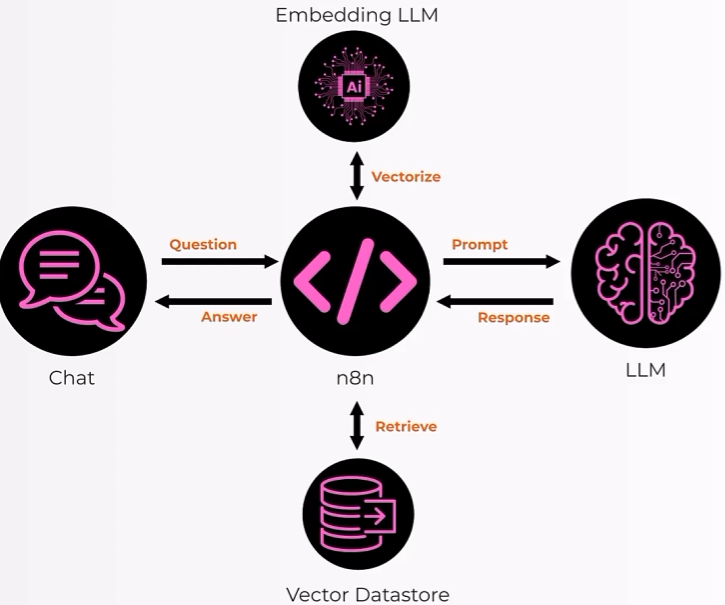
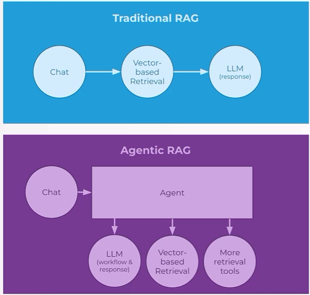
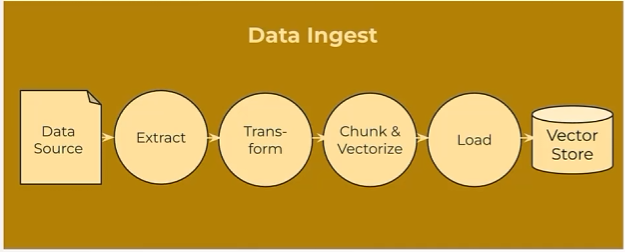

# AI Builder Course

## 5 Tricks and 1 Trap in Agentic AI
- **Illusion of Memory (Bellek Yanılsaması):** LLM'ler doğası gereği stateless'tir (hafızaları yoktur, her isteği sıfırdan işlerler). Buradaki "hile", sisteme her seferinde geçmiş sohbet/bağlam pencerelerini ekleyerek kullanıcıya kesintisiz bir hafızası varmış illüzyonu yaşatılmasıdır.
- **Thinking / Reasoning (Düşünme / Akıl Yürütme):** Modelin sadece anlık cevap üretmek yerine; karmaşık bir görevi alt adımlara bölmesi (Chain-of-Thought), plan yapması ve "Önce ne yapmalıyım?" diye mantık süzgecinden geçirmesidir. 
    - LLM aslında bir seferde tüm metni yazmak yerine kelime kelime (token token) çalışarak otoregresif bir döngü izlerler. Model, her bir adımda inference (çıkarım) yaparak mevcut bağlam üzerinden bir sonraki olasılığı hesaplar ve ilk token'ı üretir. Ardından ürettiği bu yeni veriyi hemen girdinin (input) sonuna ekler; yenilenen bu büyük bağlamı tekrar işleyerek bir sonraki çıkarım adımıyla sonraki token'ı tahmin eder. Cümle sonunu belirten özel bir durdurma simgesi (stop token) gelene kadar bu çıkarım süreci milisaniyeler içinde binlerce kez tekrarlanır. Dolayısıyla modelin metin üretirken her defasında anlık çıkarımlarla chunk chunk, yani adım adım girdiyi zenginleştirerek ilerlemesi onun temel çalışma mekanizmasını oluşturur.
    - Ayrıca bu modeller mimari olarak "Chat" ve "Reasoning" varyantları şeklinde karşımıza çıkar; ancak bazı durumlarda Chat varyantları Agentic AI uygulamalarında çok daha iyi performans gösterebilir. Öte yandan, gelişmiş modeller üzerinde çalışırken sistemin ne kadar derinlikli düşüneceğini ayarlamak için "reasoning effort" (akıl yürütme çabası) veya "thinking budget" (düşünme bütçesi) parametrelerini belirleyerek sürecin performansını ve maliyetini optimize edebilirsiniz.
    - Bu süreçte yapay zeka, milyonlarca bağlantı için önceden eğitilmiş sayısal katsayılar olan ağırlıkları (weights) kullanır; hangi kelimeye, kurala veya mantık adımına değer vereceğini ise bilinçli bir kararla değil, o anki bağlama göre matematiksel olasılıklarla tamamen kendi seçer.
- **Chaining LLMs (LLM Zincirleme):** Tek bir modelin her şeyi kusursuz yapamayacağı durumlarda, birden fazla modelin veya prompt adımının birbirine bağlanmasıdır (Örn: Bir modelin çıkışı, diğerinin girdisi olur; biri metin yazar, diğeri kodu kontrol eder).
- **Tools (Araçlar):** Yapay zekanın sadece kendi içindeki veriyle sınırlı kalmayıp; web araması yapması, veritabanına bağlanması (örneğin PostgreSQL), API'leri tetiklemesi (Marketstack vb.) veya kod çalıştırması gibi dış dünyayla etkileşime geçmesini sağlayan yetenekleridir.
- **The Loop (Döngü):** Ajanın doğrusal (tek yönlü) çalışmak yerine; bir görevi yapıp sonucu değerlendirmesi, hata alırsa (örneğin senin yaşadığın Marketstack tarih hatası gibi) hatayı görüp parametreleri değiştirerek hedefe ulaşana kadar süreci kendi kendine tekrarlamasıdır (ReAct döngüsü).
- **The Human Trap (İnsan Tuzağı):** Sistemin her şeyi tamamen otonom yapabileceğine güvenip insan denetimini (Human-in-the-loop) tamamen ortadan kaldırmaktır. Ajanlar halüsinasyon görebilir, sonsuz döngüye girebilir veya yanlış bir aracı tetikleyip sistemi bozabilir. En büyük tuzak, yapay zekayı tamamen başıboş bırakmaktır; kritik kararlarda insanın onay vermesi her zaman emniyet supaplı olmalıdır.

## N8N Terminology
- **Node:** A single step in a business process can be a Trigger or an Action
- **Connection:** A link - passes data from the output of one node to the input of another
- **Workflow:** A collection of nodes connected together to automate a process
- **Execution:** A single run of a workflow; can be Manual (testing) or Active (production)
- **Templates:** A prebuilt workflow that you can use as a starting point
- **Cloud:** A hosted environment where workflows run securely on cloud infrastructure without requiring local server management
- **Instance:** An isolated, running environment or deployment of an application (such as an n8n installation) containing its own workflows, data, and settings

## Integrations
[First Integration](./workflows/first%20integration.json): It integrates Google Sheets and Marketstack as AI tools to retrieve, manage, and update portfolio data based on financial queries.

[Second Integration](./workflows/second%20integratio.json): It integrates Gmail tools to retrieve recent messages (filtered by the last 5 days) and send automated emails to tuncaydataengineer@gmail.com.

[Push Motification](./workflows/push_notifications.json): It incorporates Pushover and Date & Time tools as AI capabilities to process requests and send automated push notifications. To run this workflow successfully, you must obtain both a User Key and an Application Key directly from pushover.net.

[Telegram Notification](./workflows/telegram_notifications.json): This n8n workflow integrates a Telegram Trigger to capture incoming chat messages and route them through an OpenAI-powered AI Agent equipped with a Date & Time tool. Within the AI Agent configuration, the prompt (User Message) is explicitly set to `{{ $json.message.text }}` to dynamically process incoming texts. The Simple Memory node uses a custom key configured as `{{ $json.message.chat.id }}` to track individual user sessions uniquely. Finally, the Send a text message node responds back to the correct chat by mapping the Chat ID to `{{ $('Telegram Trigger').item.json.message.chat.id }}` and the output text to `{{ $json.output }}`.

## Different Types of Nodes
- **Core Node:** Workflow' un temel yapı taşını oluşturan her bir adımdır. Bir Core Node temel olarak şu operasyonları gerçekleştirir:
    - Trigger: Bir iş akışını başlatan ilk adımdır (Örn: Gelen bir webhook, zamanlayıcı veya sohbet mesajı).
    - Action: Tetiklendikten sonra arka planda yapılan spesifik bir görev veya işlemdir (Örn: Veritabanına kayıt eklemek, e-posta göndermek).
- **Sub-node:** Ana bir node'un işlevini yerine getirebilmesi için ona bağlanan ve onun yapı taşı olan yardımcı bileşenlerdir (Örn: Yapay zeka ajanının kullandığı harici bir araç veya fonksiyon).
- **Cluster Node:** n8n'de özellikle gelişmiş bileşenlerde (LangChain entegrasyonlarında vb.) görülen, tek bir adım gibi görünmesine rağmen aslında birden fazla bileşeni barındıran yapılandırılmış node gruplarıdır. Yapısı şöyledir:
    - One root node: Süreci yöneten merkezî ana bileşen.
    - One or more sub-nodes: Ana node'a bağlı olarak çalışan yardımcı alt bileşenler.
- **Example of Cluster Node: AI Agent** n8n'deki AI Agent düğümü tipik bir Cluster Node yapısıdır; ortada ana beyin (Root node) bulunur, etrafına ise hafıza (Memory) veya araçlar (Tools) gibi sub-node'lar bağlanarak ortak bir çalışma kümesi oluşturur.

## Nodes Work With Items

- **Data flows in as an array of items:** n8n'de veriler tekil olarak değil, bir item dizisi (array) şeklinde akar. Örneğin bir node'a giriş yapan veri yapısı şu şekildedir:
```json
[
  {"fruit": "apples"},
  {"fruit": "bananas"}
]
```

- **An expression is applied to every item** Yazılan bir ifade (expression) array' deki her bir item'a tek tek (otomatik olarak döngüye girmiş gibi) uygulanır. Örneğin şu ifade kullanıldığında:
```json
{{ $json.fruit.toUpperCase() }}
```

- Çıktıdaki tüm meyve isimleri büyük harfe dönüştürülür:
```json
[
  {"fruit": "APPLES"},
  {"fruit": "BANANAS"}
]
```

- **Key Notes:** 
    - $json kısayolu: `$json`, aslında `$input.item.json` ifadesinin daha kısa ve pratik bir yazılışıdır. İşlem yapılan o anki item'ın JSON verisine hızlıca erişmeyi sağlar.
    - Çoklu veri yönetimi: Şimdiye kadar yapılan basit örneklerin aksine, n8n altyapısı bu şekilde tek seferde birden fazla item (öğe) içeren array' leri işleme yeteneğine sahiptir.


[Equity Portfolio Rebalancer](./workflows/equity_portfolio_rebalancer.json): This n8n workflow automates portfolio rebalancing by triggering an AI Agent via a web form submission to achieve a target asset allocation. The AI Agent dynamically interacts with Google Sheets and Marketstack to fetch financial data, execute trades, and update records iteratively until the target is met. Finally, it validates the results using an IF condition to send success or failure notifications via Pushover and Gmail.

## Deeper Terminology on APIs
- **API**
    - I'm calling an API by making an HTTP request to an endpoint.
- **Webhook**
    - I've set up a Webhook make an HTTP request there to notify me about X.
    - Tell me your Webhook so I can notify you.


[N8N with Elevenlabs](./workflows/n8n_elevenlabs.json): This n8n workflow functions as an end-to-end voice assistant pipeline. It receives an audio file via a Webhook, transcribes it to text using ElevenLabs, and passes it to an AI Agent powered by Google Gemini to generate a smart response. Finally, ElevenLabs converts the AI's text reply back into spoken audio, which is sent back to the user as a binary response.

[Elevenlabs with N8N](./workflows/elevenlabs_n8n.json): This n8n workflow acts as an automated API endpoint powered by an AI portfolio assistant. When a webhook receives a POST request with a question, it forwards the query to a Google Gemini AI Agent. Equipped with a Google Sheets tool, the agent dynamically accesses the user's equity portfolio spreadsheet to retrieve financial holdings, processes the data, and returns a smart, context-aware answer via the webhook response node.

## RAG
- An embedding model—often referred to interchangeably as an encoder or vector model—is an AI tool that converts text, images, or audio into numbers (vectors) that capture their semantic meaning. By placing similar concepts close to each other in a mathematical space, it allows computers to understand context, compare information, and power tasks like semantic search, recommendation systems, and AI retrieval (RAG).



- This diagram illustrates a Retrieval-Augmented Generation (RAG) workflow orchestrated by n8n. The process begins when a user submits a question through the chat interface to n8n. To find the right information, n8n interacts with a Vector Datastore, which stores pre-processed documents and data converted into numerical vectors by an Embedding LLM using a "vectorize" process. n8n queries this Vector Datastore to "retrieve" the most relevant contextual data matching the user's inquiry. Once this context is gathered, n8n combines it with the user's question to form a structured prompt, which is then sent to the main LLM. Finally, the LLM processes this prompt, generates a response back to n8n, and n8n delivers the final answer to the user through the chat interface.

## RAG vs Agentic RAG





- **Data Ingestion (Top):** Raw data from a source is extracted, transformed, split into smaller pieces and vectorized (Chunk & Vectorize), and then loaded into a Vector Store.
    - Chunking and Vectorization are critical steps in preparing data for semantic search within a RAG pipeline.
    - Chunking involves breaking down large documents, such as PDFs or web pages, into smaller, manageable pieces (like paragraphs or sentence groups) while preserving their contextual meaning. This is necessary because feeding an entire, lengthy document to an AI model is inefficient and leads to context loss, whereas smaller chunks allow for precise retrieval of relevant information. Vectorization, on the other hand, takes these individual text chunks and passes them through an embedding model to transform them into high-dimensional numerical arrays or vectors. This mathematical conversion captures the semantic relationships between words, enabling the system to compare a user's query vector against the database vectors and quickly find the most relevant matches based on similarity scores.

## Vector Database

[Vector Database](./scripts/vector_database.sql): This SQL code creates a vector search structure in a PostgreSQL database (typically using the pgvector extension) to power a RAG (Retrieval-Augmented Generation) system. It consists of two main parts:
- Table Creation (knowledgebase): Sets up a table with an id, text content, JSONB metadata for filtering, and an embedding vector field (dimension size 1536, matching OpenAI embedding models) to store document chunks.
- Similarity Search Function (match_documents): Defines a custom SQL function that takes a query embedding, compares it against stored document vectors using cosine distance (<=>), applies any JSONB metadata filters, and returns the top matching results ordered by relevance similarity.

[Supabase](./workflows/supabase.json): This JSON workflow automates the process of extracting product data from a Google Sheets document and storing it as vector embeddings in a Supabase database for an AI-powered RAG (Retrieval-Augmented Generation) pipeline. Here is a step-by-step breakdown of how the workflow operates:
- Trigger & Data Retrieval: The workflow is initiated manually (When clicking ‘Execute workflow’) and fetches product rows containing fields like name, category, SKU, price, and description from a Google Sheets file using the Get row(s) in sheet node.
- Data Preparation: The Edit Fields node formats the raw spreadsheet columns into a structured text block (content) and a separate category field for metadata tracking.
- Embedding & Loading: The Default Data Loader converts the processed text into documents, while the Embeddings OpenAI node generates vector representations using OpenAI's embedding models.
- Vector Storage: Finally, the Supabase Vector Store node inserts these vector embeddings and metadata into the knowledgebase table in Supabase, making the product catalog searchable via semantic similarity.

[Agentic RAG](./workflows/agentic_rag.json): This JSON workflow implements an **Agentic RAG (Retrieval-Augmented Generation)** system exposed via an API endpoint, allowing an intelligent AI agent to answer dynamic user queries using a vector database. Here is a step-by-step breakdown of how the workflow operates:
- **Trigger & Request Handling:** The workflow starts with an incoming HTTP **Webhook** that receives user questions through a POST request body (`{{ $json.body.question }}`).
- **Core Agent Intelligence:** The **AI Agent** processes the prompt using the **Google Gemini Chat Model** as its underlying reasoning engine, managing the conversational logic and decision-making process.
- **Vector Tool Integration:** The **Supabase Vector Store** is connected to the agent as an **AI Tool** (`retrieve-as-tool`), utilizing **OpenAI Embeddings** to semantically search the `knowledgebase` table whenever product or company information is needed.
- **Response Delivery:** Once the agent formulates its answer based on the retrieved context, the **Respond to Webhook** node sends the final output back to the client.

## Selh Hosted N8N
[N8N with Docker] (https://docs.n8n.io/deploy/host-n8n/install-options/install-with-docker)

```bash
docker volume create n8n_data

docker run -it --rm \
  --name n8n \
  -p 5678:5678 \
  --add-host=host.docker.internal:host-gateway \
  -e GENERIC_TIMEZONE="Europe/Istanbul" \
  -e TZ="Europe/Istanbul" \
  -e N8N_ENFORCE_SETTINGS_FILE_PERMISSIONS=true \
  -e N8N_RUNNERS_ENABLED=true \
  -v n8n_data:/home/node/.n8n \
  docker.n8n.io/n8nio/n8n
```

[Self Hosted First Workflow](./workflows/self_hosted_first_workflow.json): This n8n workflow establishes an AI Agent powered by a local Ollama model (ministral-3), configured with chat trigger input and window buffer memory to maintain contextual conversations. The agent is equipped with two custom tools—a Google Sheets integration to retrieve computer hardware product details and a Marketstack tool for querying real-time financial market data—directed by a specific system prompt that governs tool selection based on user queries.

[From Google Drive to PDF](./workflows/from_drive_to_pdf.json): This n8n workflow monitors a specific Google Drive folder for newly created files and sends a notification via Pushover when a file arrives. It then downloads the file, extracts its text content using the Extract from File node, and sends the extracted text as a follow-up notification through Pushover.

